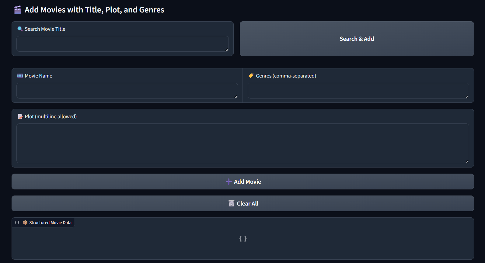
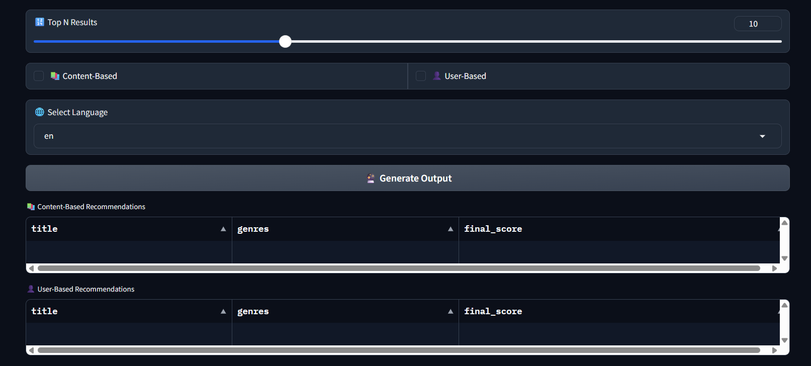

# 🎥 Intelligent Movie Recommendation System

An advanced, hybrid **Movie Recommendation Engine** built with modern deep learning techniques, offering both **content-based** and **user-based collaborative filtering**, with scalable similarity search using **FAISS** and deployed via a **Gradio UI**.




---

## 🌐 How to Use on Hugging Face Spaces

This Movie Recommendation System is deployed on **Hugging Face Spaces** for easy access. No local setup or dataset download is required! Follow these steps to get personalized movie recommendations:

1. **Visit the App**: Access the Gradio UI on our [Hugging Face Space](https://huggingface.co/spaces/srabanmondal/movie-recommendations)
2. **Search or Add Movies**:
   - Enter a movie title in the search bar. If found in our dataset (~200K movies), the plot and genres are auto-fetched.
   - If the movie isn’t found, manually enter the title, plot, and genres (comma-separated, e.g., "Action, Drama").
   - Add multiple movies to your watchlist to refine recommendations.
3. **Customize Options**:
   - Toggle between **Content-Based** (based on movie plots/genres/topics) or **User-Based Collaborative** (based on ~5K user preferences) recommendations.
   - Select the output language for recommendations.
   - Choose the number of recommendations (5–20).
4. **Generate Recommendations**: Click "Generate Output" to see a table of recommended movies with similarity scores.
5. **Clear Watchlist**: Use the "Clear All" button to reset and start fresh.

> **Note**: The dataset is private and not available for download. All processing happens on the Hugging Face Space, ensuring seamless access without needing personal tokens or local setup.

---

## 🚀 Overview

This project provides smart movie recommendations using both **content-based filtering** and **collaborative filtering**. It doesn't rely on simple keyword overlap or naive co-occurrence methods — instead, it deeply understands movie *plots*, *genres*, and *topics* using **sentence-level semantic embeddings**.

🔧 Key Features:
- Deep semantic understanding of **plots**, **genre tags**, and **topics** using **BERT-based embeddings**.
- Powerful **FAISS-based nearest neighbor** search for lightning-fast similarity matching across 200K+ movies.
- **User-behavior-based recommendations** using collaborative filtering from actual user preferences.
- Optimized and memory-efficient pipelines using `mmap`, `.npz`, and FAISS indexing.
- Fully interactive **Gradio UI** with:
  - Dynamic movie entry system
  - Auto-fetch plot/genres for known titles
  - Manual editing for unknown or custom movies
  - Toggle for content vs collaborative recommendations
  - Adjustable number of results and language filtering

---

## 📚 Technical Breakdown

### 💾 Dataset Engineering

- Combined and cleaned multiple movie datasets and user preference datasets to create:
  - `movie_metadata.parquet`: Plot, genre, language, title, and more.
  - `user_metadata.parquet`: User → favorite movies mapping.

- Each movie is embedded using:
  - **Plot & Genre**: `all-MiniLM-L6-v2` (368-d)
  - **Topic Modeling**: BAAI `bge-base-en-v1.5` (768-d)
  - Combined: 1536-d embedding vector used in FAISS.

- Preprocessing included:
  - Genre tag normalization (case/space insensitive)
  - Topic modeling with BERTopic for deep thematic similarity
  - Genre de-biasing to reduce over-representation of common tags
  - Collaborative filtering user profile generation from favorite movies

> ⚠️ **Note**: Cleaned and preprocessed dataset is **not provided publicly** due to size and effort involved. Please don’t request the dataset — this is a demonstration project only.

---

### 🧠 Recommendation Logic

The recommendation engine powers two modes: **Content-Based** and **User-Based Collaborative**, implemented in `utils/recommend.py`. Both return a **Pandas DataFrame** with recommended movies, including `title`, `genres`, and `final_score` (a weighted combination of recommendation similarity and movie ratings).

#### 1. Content-Based Recommendations
- **Function**: `recommend(movie_names, provided_plots=None, provided_genres=None, top_k=20, language=None)`
- **How It Works**:
  - Takes a list of movie titles (`movie_names`) from the user’s watchlist.
  - If a title isn’t in the dataset (~200K movies), uses `provided_plots` and `provided_genres` (from Gradio’s manual entry) to generate embeddings.
  - Combines embeddings (368-d `all-MiniLM-L6-v2` for plots/genres + 768-d `bge-base-en-v1.5` for topics) into a 1536-d vector.
  - Queries a **FAISS index** to find the top `top_k` similar movies.
  - Filters by `language` if specified (e.g., "en" for  "English").
  - Returns a DataFrame with `title`, `genres`, and `final_score` (weighted cosine similarity + ratings).

#### 2. User-Based Collaborative Recommendations
- **Function**: `recommend_from_users(movie_names, top_k_users=10, top_k_movies=20, language=None, provided_plots=None, provided_genres=None)`
- **How It Works**:
  - Takes a list of movie titles (`movie_names`) to build a user profile.
  - If titles are missing from the dataset, uses `provided_plots` and `provided_genres` for embeddings.
  - Matches the user’s embedding against ~5K user profiles in `user_metadata.parquet` using a FAISS index to find `top_k_users` similar users.
  - Aggregates unseen movies from these users’ favorites, ranking by frequency and ratings.
  - Filters by `language` if specified.
  - Returns a DataFrame with `title`, `genres`, and `final_score`.

#### Output Format
Both functions return a **Pandas DataFrame** with:
- `title`: Movie title (str).
- `genres`: Comma-separated genres (str).
- `final_score`: Weighted score combining recommendation similarity and movie ratings (float, 0–1).

**Example Output**:
```
| title              | genres           | final_score |
|--------------------|------------------|-------------|
| The Matrix         | Action, Sci-Fi   | 0.92        |
| Blade Runner 2049  | Sci-Fi, Thriller | 0.89        |
```
> **Note**: The system handles missing movies gracefully via manual plot/genre entry in the Gradio UI, ensuring robust recommendations even for niche titles.

---

## 🖥️ Gradio UI Guide

### 🧾 Interface Flow

1. 🔍 **Search Movie Title**:
   - Auto-fetches plot and genres from dataset.
   - If not found, manual plot and genre entry allowed.

2. ➕ **Add Movie**:
   - Add title, plot, and genre(s) to your watchlist.
   - You can enter multiple genres as comma-separated text.

3. 🧹 **Clear All**:
   - Clears the current movie watchlist.

4. 🎛️ **Options**:
   - ✅ Toggle content-based or user-based recommendations
   - 🌐 Select output movie language
   - 🔢 Choose number of recommendations (5–20)

5. 🔮 **Generate Output**:
   - Displays recommendations in tabular format with scores.

---

## 🗂️ Folder Structure
```
├── app.py # Gradio entrypoint
├── utils/
│ └── recommend.py # All backend logic
├── demo/
│ ├──1.jpg
│ └──2.jpg
├── requirements.txt
└── README.md
```

---

## 🧠 Future Enhancements

- Add **trailer thumbnails** via TMDB API
- Personalized feedback-based re-ranking

---

## ❤️ Special Thanks

Thanks to:
- `sentence-transformers` for plug-and-play embedding models
- `faiss` for ultra-fast similarity search
- `Gradio` for beautiful and flexible front-end interaction

---
